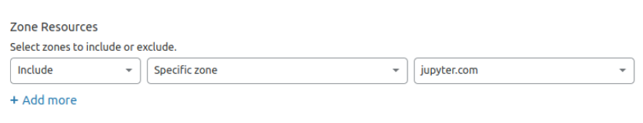
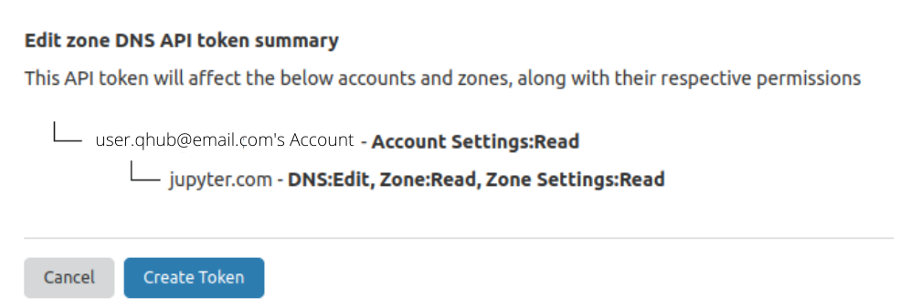

# Setup Initialization

QHub handles the initial setup and management of configurable data science environments, allowing to users to attain
seamless deployment with Github Actions.

QHub can be installed on a bare-metal server using HPC, on a CLoud provider or even locally for testing purposes.
Analyse the options below to discover what option suits best your specific use case.

## Local Deployment
The local version is recommended for testing QHub's components due to
its simplicity. Choose the local mode if:
- You already have Kubernetes clusters
- You want to test these Kubernetes clusters
- You have available local compute setup
- You want to try out QHub with a quick-install to see how it works, without setting up environment variables

You should choose another installation option if you are starting from scratch (i.e., no clusters yet) and aiming to
have a production environment.

Found your match? Head over to the [Local install docs](../06_developers_contrib_guide/04_tests.md#local-testing) for more details.

## On Premises deployment
The [QHub HPC](https://onprem.qhub.dev/en/latest/) should be your choice if:
- You require high compute resources
- You have an either physical or Cloud existing infrastructure available
- You expect that your infrastructure will **not** exert the existing resources capabilities
> NOTE: Although it is possible to deploy QHub HPC on the Cloud, it is not generally recommended due to possible high
> costs. For more information, check out the [base cost](../05_reference/03_base_cost.md) section of the docs.

## Cloud Deployment

The Cloud version of QHub is considered to be the default option. If you are not sure which option to choose, try this
one. It is suitable to most use cases, specially when:
- You require a scalable infrastructure
- You aim to have a production environment with GitOps enabled by default

The QHub cloud version requires a choice of [Cloud
provider](#cloud-provider), [authentication (using Auth0, GitHub, or
password based)](#authentication), [domain
registration](#domain-registry), and CI provider (GitHub Actions).

These services require global [environment
variables](https://linuxize.com/post/how-to-set-and-list-environment-variables-in-linux/)
that once set up will trigger QHub's automatic deploy using GitHub
Actions.

To find and set the environment variables, follow the steps described
on the subsections below.

### Cloud Provider

The first required step is to **choose a Cloud Provider to host the
project deployment**. The cloud installation is based on Kubernetes,
but knowledge of Kubernetes is **NOT** required nor is in depth
knowledge about the specific provider required either. QHub supports
[Amazon AWS](#amazon-web-services-aws),
[DigitalOcean](#digital-ocean), [GCP](#google-cloud-platform), and
[Azure](#microsoft-azure).

To deploy QHub, all access keys require fairly wide permissions to
create all the resources. Hence, once the Cloud provider has been
chosen, follow the steps below and set the environment variables as
specified with **owner/admin** level permissions.

For more details on configuration for each Cloud provider, check the
How-To Guides section of the documentation.

#### Amazon Web Services (AWS)
<details><summary>Click for AWS configuration instructions </summary>

Please see these instructions for [creating an IAM
role](https://docs.aws.amazon.com/IAM/latest/UserGuide/id_roles_create.html)
with administrator permissions. Upon generation, the IAM role will provide a public **access
key ID** and a **secret key** which will need to be added to the environment variables. Additionally, you will also need to
set the [AWS region](https://docs.aws.amazon.com/AWSEC2/latest/UserGuide/using-regions-availability-zones.html)
where you intend to deploy your QHub infrastructure.

To define the environment variables paste the commands below with your respective keys.

```bash
export AWS_ACCESS_KEY_ID="HAKUNAMATATA"
export AWS_SECRET_ACCESS_KEY="iNtheJUng1etheMightyJUNgleTHEl10N51eEpsT0n1ghy;"
export AWS_DEFAULT_REGION="eu-west-2"
```
</details>

#### Digital Ocean
<details><summary>Click to expand DigitalOcean configuration directions </summary>

Please see these instructions for [creating a Digital Ocean
token](https://www.digitalocean.com/docs/apis-clis/api/create-personal-access-token/). In
addition to a `token`, `spaces key` (similar to AWS S3) credentials are also required. Follow the instructions on the
[official docs](https://www.digitalocean.com/community/tutorials/how-to-create-a-digitalocean-space-and-api-key) for more information.
> Note: DigitalOcean's permissions model is not as fine-grained as other the other supported Cloud providers.

Set the required environment variables as specified below:

```bash
export DIGITALOCEAN_TOKEN=""          # API token required to generate resources
export SPACES_ACCESS_KEY_ID=""        # public access key for access spaces
export SPACES_SECRET_ACCESS_KEY=""    # the private key for access spaces
export AWS_ACCESS_KEY_ID=""           # set this variable with the same value as `SPACES_ACCESS_KEY_ID`
export AWS_SECRET_ACCESS_KEY=""       # set this variable identical to `SPACES_SECRET_ACCESS_KEY`
```
</details>

#### Google Cloud Platform

<details><summary>Click for CGP configuration specs </summary>

Follow [these detailed instructions](https://cloud.google.com/iam/docs/creating-managing-service-accounts) to create a
Google Service Account with **owner level** permissions. Then, follow the steps described on the official
[GCP docs](https://cloud.google.com/iam/docs/creating-managing-service-account-keys#iam-service-account-keys-create-console)
to create and download a JSON credentials file. Store this credentials file in a well known location and make sure to
set yourself exclusive permissions.

You can change the file permissions by running the command `chmod 600 <filename>` on your terminal.

In this case the environment variables will be such as follows:
```bash
export GOOGLE_CREDENTIALS="path/to/JSON/file/with/credentials"
export PROJECT_ID="projectIDName"
```
> NOTE: the [`PROJECT_ID` variable](https://cloud.google.com/resource-manager/docs/creating-managing-projects) can be
> found at the Google Console homepage, under `Project info`.
</details>

#### Microsoft Azure

<details><summary>Click for Azure configuration details </summary>

Follow [these instructions](https://registry.terraform.io/providers/hashicorp/azurerm/latest/docs/guides/service_principal_client_secret#creating-a-service-principal-in-the-azure-portal)
to create a Service Principal in the Azure Portal. After completing the steps described on the link, set the following environment variables such as below:
```bash
export ARM_CLIENT_ID=""           # application (client) ID
export ARM_CLIENT_SECRET=""       # client's secret
export ARM_SUBSCRIPTION_ID=""     # value available at the `Subscription` section under the `Overview` tab
export ARM_TENANT_ID=""           # field available under `Azure Active Directories` > `Properties` > `Tenant ID`
```
> NOTE 1: Having trouble finding your Subscrition ID? [Azure's official docs](https://docs.microsoft.com/en-us/azure/media-services/latest/how-to-set-azure-subscription?tabs=portal)
> might help.

> NOTE 2: [Tenant ID](https://docs.microsoft.com/en-us/azure/active-directory/fundamentals/active-directory-how-to-find-tenant)
> values can be also found using Power Shell and CLI.

### Authentication

#### Auth0

Auth0 is a great choice to enable flexible authentication via multiple
providers. To create the necessary access tokens you will need to have
an [Auth0](https://auth0.com/) account and be logged in. [Directions
for creating an Auth0
application](https://auth0.com/docs/applications/set-up-an-application/register-machine-to-machine-applications).

- Click on the `Applications` button on the left
- Select `Create Application` > `Machine to Machine Applications` > `Auth0 Management API` from the dropdown menu
- Next, click `All` next to `Select all` and click `Authorize`
- Set the variable `AUTH0_CLIENT_ID` equal to the `Cliend ID` string, and do the same for the `Client secret` by running the command below.

The following environment variables must be set:

 - `AUTH0_CLIENT_ID`: client ID of Auth0 machine-to-machine application
 - `AUTH0_CLIENT_SECRET`: secret ID of Auth0 machine-to-machine application
 - `AUTH0_DOMAIN`: Finally, set the `AUTH0_DOMAIN` variable to your account name (indicated on the upper right-hand
   corner) appended with `.auth0.com`, for example:

```bash
export AUTH_DOMAIN="qhub-test.auth0.com" # in case the account was called 'qhub-test'
```

#### GitHub

QHub uses GitHub Actions to enable [Infrastructure as
Code](https://en.wikipedia.org/wiki/Infrastructure_as_code) and
trigger the CI/CD checks on the configuration file that automatically
generates the deployment modules for the infrastructure. To
do that, it will be necessary to set the GitHub username and token as
environment variables. First create a github personal access token via
[these
instructions](https://docs.github.com/en/github/authenticating-to-github/creating-a-personal-access-token). The
token needs permissions to create a repo and create secrets on the
repo. At the moment we don't have the permissions well scoped out so
to be on the safe side enable all permissions.

 - `GITHUB_USERNAME`: your GitHub username
 - `GITHUB_TOKEN`: token generated by GitHub

### Domain registry

Finally, you will need to have a domain name for hosting QHub. This
domain will be where your application will be exposed.

Currently, QHub only supports CloudFlare for automatic DNS
registration. If an alternate DNS provider is desired, change the
`--dns-provider` flag from `cloudflare` to `none` on the `qhub deploy`
command. The deployment then will be paused when it asks for an IP
address (or CNAME, if using AWS) and prompt to register the desired
URL. Setting a DNS record heavily depends on the provider thus it is
not possible to have detailed docs on how to create a record on your
provider. Googling `setting <A/CNAME> record on <provider name>`
should yield good results on doing it for your specific provider.

#### Cloudflare

QHub supports Cloudflare as a DNS provider. If you choose to use Cloudflare, first
create an account, then there are two possible following options:
1. You can either register your application domain name on it, using the [Cloudflare
nameserver](https://support.cloudflare.com/hc/en-us/articles/205195708-Changing-your-domain-nameservers-to-Cloudflare)
(recommended), or
2. You can outright buy a new domain with Cloudflare (this action is not particularly recommended).

To generate a token [follow these steps](https://developers.cloudflare.com/api/tokens/create):

- Under `Profile`, select the `API Tokens` menu and click on `Create API Token`.
- On `Edit zone DNS` click on `Use Template`.

- Configure `Permissions` such as the image below:

- On `Account Resources` set the configuration to include your desired account

- On `Zone Resources` set it to `Include | Specific zone` and your domain name

- Click continue to summary

- Click on the `Create Token` button and set the token generated as an environment variable on your machine.

Finally, set the environment variable such as:
```bash
 export CLOUDFLARE_TOKEN="cloudflaretokenvalue"
```

You are now done with the hardest part of the deployment.

On the next section, you will create the main file structure and
render configuration modules to generate the deployment
infrastructure.
