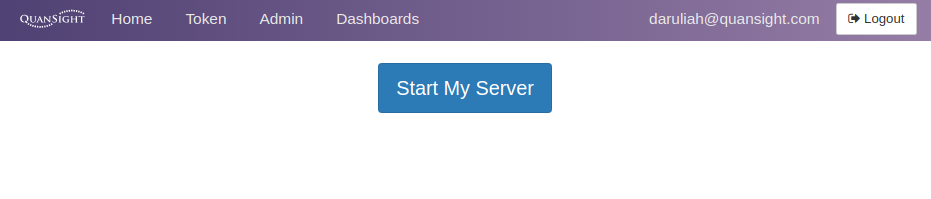
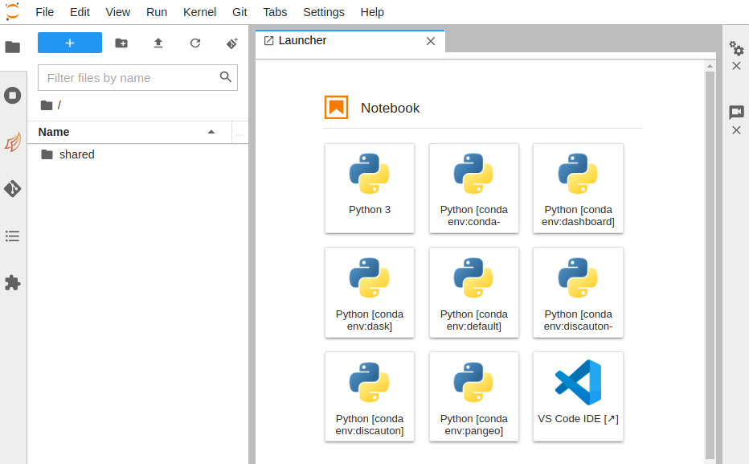

# How to log in on QHub (training)

This guide aims to explain to newcomers how to log in to Quansight's own QHub Training server (for training sessions). 
Your own organization's QHub is likely to have a different procedure.

To access the training platform, you will need to:
1. Register on [https://training.qhub.dev](https://training.qhub.dev).

2. Enter your email address (the same one associated with this invitation).

3. Next, you should then receive an email from **Quansight-training** with a 6-digit code (remember to check your spam folder, just in case).

4. Copy the code, head back over to the [https://training.qhub.dev](https://training.qhub.dev) webpage and paste it when prompted.

5. This should allow you to launch the QHub instance for training. Once logged in, you should see the page below.

6. Once the `Start my Server` button is clicked, you will be prompted with different server instances to choose from.

7. Click on the `Training Default` option (or whichever option your instructor has directed you to) and wait  to access your new JupyterHub instance, similar to the image below.

Congratulations, you are now logged in to QHub!

> In case you run into any issues, please contact your instructor via email.