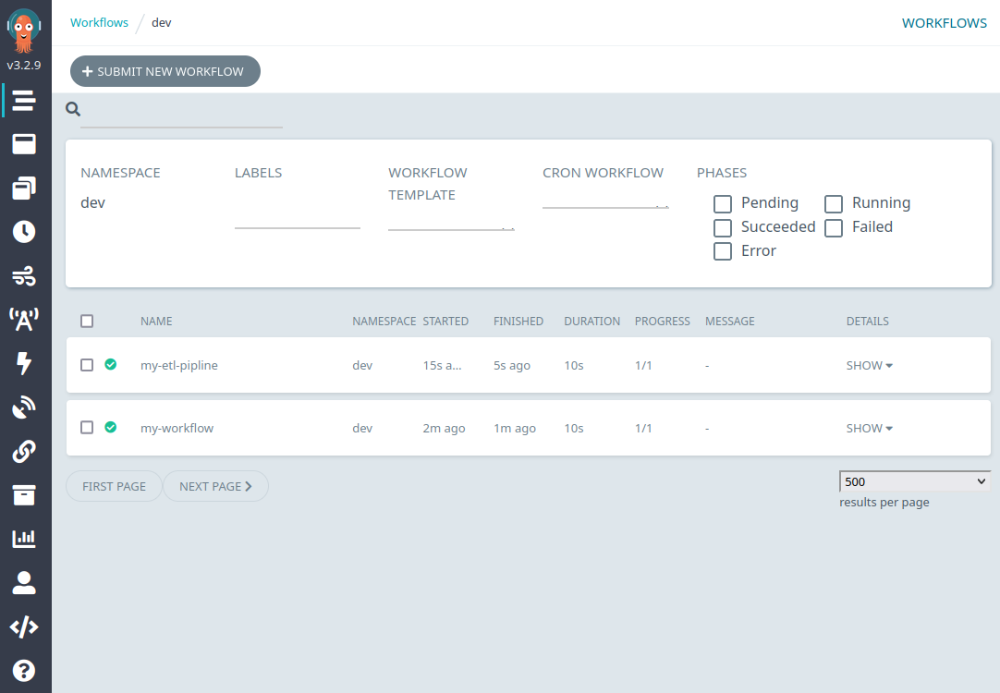

# Argo Workflows

Argo Workflows is an open source container-native workflow engine for orchestrating parallel jobs on Kubernetes. Argo workflows comes enabled by default with Qhub deployments.

## Accessing Argo Server

If Argo Workflows is enabled, users can access argo workflows server at: `your-qhub-domain.com/argo`. Log in via Keycloak with your usual credentials.

Refer to the [Argo documentation](https://argoproj.github.io/argo-workflows/) for further details on Argo Workflows.

## Submitting a workflow via Argo Server

You can submit a workflow by clicking "SUBMIT NEW WORKFLOW" on the landing page.



## Disabling Argo Workflows

1. To turn off the cluster monitoring on QHub deployments, simply turn off the feature flag within your `qhub-config.yaml` file. For example:

```yaml
argo_workflows:
  enabled: false
```
