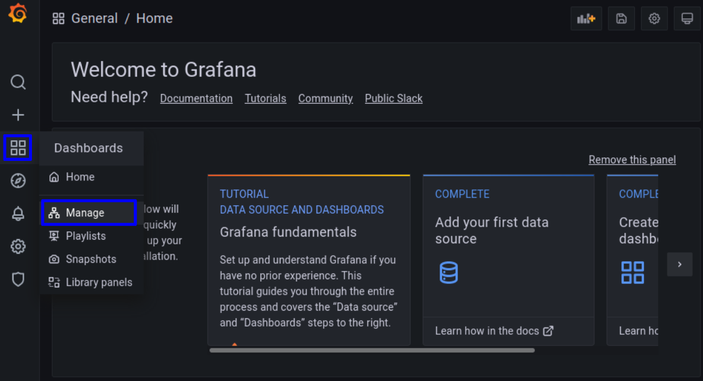
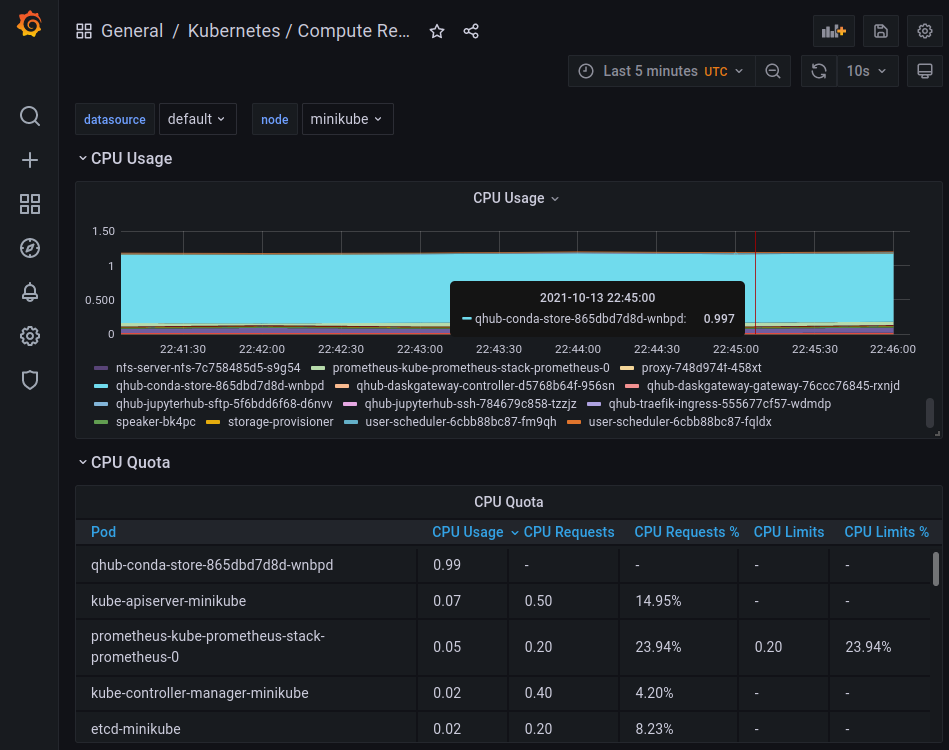
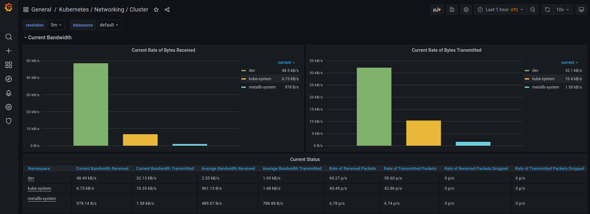

# Monitoring

Cluster monitoring via Grafana/Prometheus comes built in with QHub. It's enabled by default.

## Accessing the Grafana dashboards

Users can access the monitoring dashboards via Grafana at: `your-qhub-domain.com/monitoring`. The initial login credentials are username: `admin` and password: `prom-operator`, but
users should change the administrator password immediately after the first log in.

More than 25 prebuilt dashboards come with Qhub. To access them, hover over the dashboards icon, then click "Manage" as indicated in the image below.



For example, the General/Kubernetes/Compute Resources/Node/Pods dashboard allows you to easily see which pods are using the most compute and memory on a particular node of your
kubernetes cluster.



Additionally, the General/Kubernetes/Networking/Cluster/Pods dashboard gives a nice overview of network traffic in your kubernetes cluster.



Select the [Grafana documentation](https://grafana.com/docs/grafana/latest/) for further details on Grafana.

## Disabling Cluster monitoring

1. To turn off the cluster monitoring on QHub deployments, simply turn off the feature flag within your `qhub-config.yaml` file. For example:

```yaml
monitoring:
  enabled: false
```
