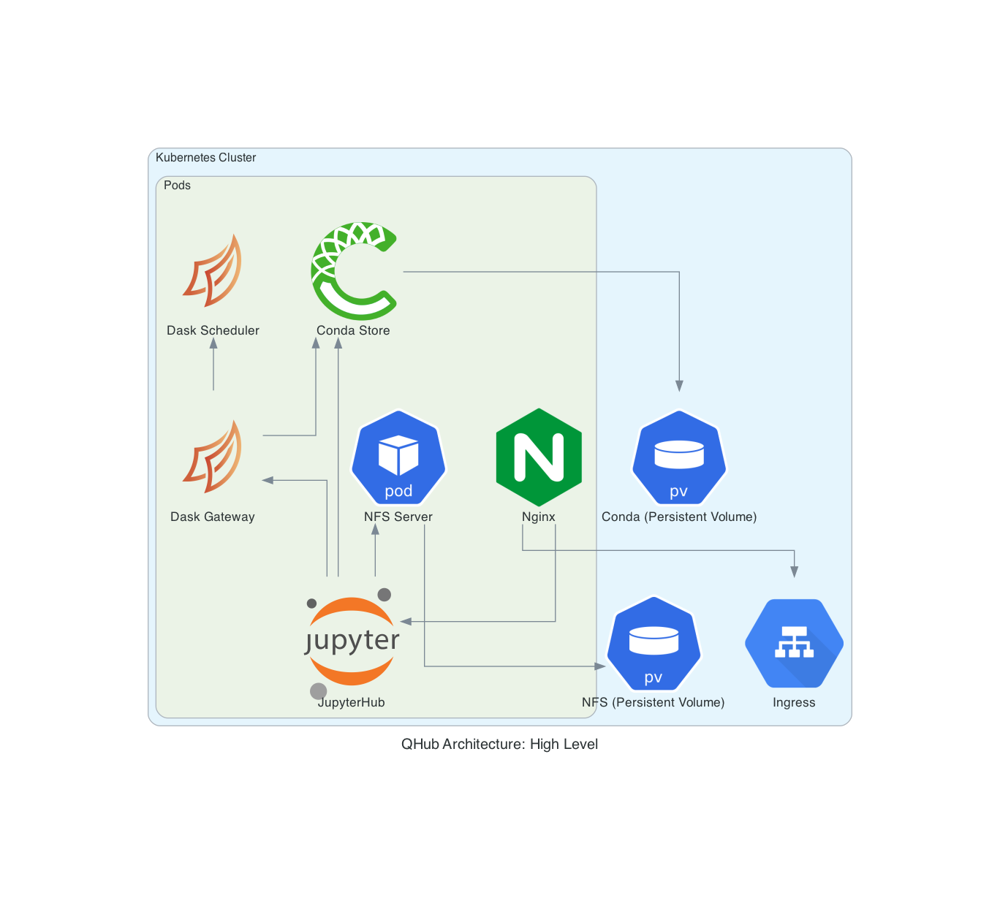

# Developer docs

QHub admins are **DevOps engineers**, **system administrators**,
**scientists**, and **network architects** who are responsible for the
critical infrastructure that data scientists and engineers need to
thrive. QHub is bundled with features that make installation easy
while providing the ability to scale with your organization and data.

> The content below is particularly for QHub producers, and those looking to learn more about the QHub architecture.

## Installation

You can install QHub through `pip`:

    pip install qhub-ops

After the installation, the next step is to configure QHub.

## Configuration

QHub is entirely controlled from a configuration file, which allows you to manage multiple environments and multiple teams, as well as their permissions and authorization in a robust way.

+ **The Configuration File**
  + QHub comes with configuration file templates for each of the cloud providers it currently supports: **AWS**, **DO**, **GCP**, and **Azure**. The templates can be found [**here**](../installation/configuration.md).
  
## Why QHub

With QHub, managing configurable data science environments and attaining seamless deployment with [**Github Actions**](https://github.com/marketplace/actions/deployment-action) become remarkably easy. Let's look at how you can customize QHub for a data science architecture that meets  **your team's needs**.

## Staging & Production Environments and Shell Access

With QHub, you can have shell access and remote editing access through KubeSSH. The complete linux style permissions allows for different shared folders for different groups of users.

QHub comes with staging and production environments, as well as JupyterHub deploys.

## QHub Architecture

 In addition to a robust integration of [**Dask**](https://dask.org/) and a new way of distributing environments with [**conda-store**](https://github.com/quansight/conda-store), QHub brings together some of the widely used cloud deployment components in its architecture.

 QHub integrates [**Network File System (NFS)**](https://en.wikipedia.org/wiki/Network_File_System) protocol is used to allow Kubernetes applications to access storage. Files in containers in a [**Kubernetes Pod**](https://kubernetes.io/docs/concepts/workloads/pods/pod/) are not persistent, which means if a container crashes, [**kubelet**](https://kubernetes.io/docs/reference/command-line-tools-reference/kubelet/#:~:text=Synopsis,object%20that%20describes%20a%20pod) will restart the container, however, the files will not be preserved. The [**Kubernetes Volume**](https://kubernetes.io/docs/concepts/storage/volumes/#types-of-volumes) abstraction that QHub utilizes solves this problem.

NFS shares files directly from a container in a Kubernetes Pod, and sets up a [**Kubernetes Persistent Volume**](https://kubernetes.io/docs/concepts/storage/persistent-volumes/) accessed via NFS. Kubernetes' built‑in configuration for HTTP load balancing [**Ingress**](https://kubernetes.io/docs/concepts/services-networking/ingress/) defines and controls the rules for external connectivity to Kubernetes services. Users who need to provide external access to their Kubernetes services create an Ingress resource that defines rules.

QHub streamlines and manages all the Kubernetes architecture detailed above and delivers a smooth deployment process to its users through its intuitive interface.

QHub architecture and features allows you to:

+ manage configurable data science environments

+ handle multiple environments in a robust way

+ have seamless deployment with github actions

+ meet the needs of multiple teams and control permissions

## Cloud Deployment on QHub

QHub deployments on the clouds follow the architectural structure shown for each provider in the diagrams below. To make cloud deployments, the respective configuration file needs to be configured based on the user's cloud provider account credentials, as well as the details of users they would allow access to the deployment.

### Infrastructure Provisioning (Common for all Clouds)

To provision the infrastructure, QHub uses [**Terraform**](https://www.terraform.io/), a tool for building, changing, and versioning infrastructure safely and efficiently. Terraform enables QHub to have Infrastructure as Code to provision and manage cloud, infrastructure or service. Terraform has a system of modules/provider for dealing with various cloud providers and various kinds of infrastructure, for instance it has modules for [**Amazon Web Services (AWS)**](https://aws.amazon.com/), [**Google Cloud Platform (GCP)**](https://cloud.google.com/gcp/?utm_source=google&utm_medium=cpc&utm_campaign=na-US-all-en-dr-bkws-all-all-trial-e-dr-1009135&utm_content=text-ad-lpsitelinkCCexp2-any-DEV_c-CRE_113120492887-ADGP_Hybrid+%7C+AW+SEM+%7C+BKWS+%7C+US+%7C+en+%7C+EXA+~+Google+Cloud+Platform-KWID_43700009942847400-kwd-26415313501&utm_term=KW_google%20cloud%20platform-ST_google+cloud+platform&gclid=CjwKCAjw9vn4BRBaEiwAh0muDLoAixDimMW9Sq12jfyBy6dMzxOU7ZW6-w44qWTJo-zRdpnBojzbexoCNGsQAvD_BwE), [**Digital Ocean (DO)**](https://www.digitalocean.com/), as well as for [**Kubernetes**](https://kubernetes.io/) and [**Helm**](https://helm.sh/).

### Kubernetes (Common for all Clouds)

To manage the deployments on the Kubernetes cluster, QHub uses Helm, a package manager for Kubernetes. Helm packages Kubernetes configurations for deployment for ease of distribution so that you can simply use a ready made package and deploy it to your Kubernetes cluster.

The services are exposed via an [**Ingress**](https://kubernetes.io/docs/concepts/services-networking/ingress/) component of Kubernetes. Helm uses a packaging format called [**Charts**](https://helm.sh/docs/topics/charts/), which is a collection of files that describe a related set of Kubernetes resources. Charts can be packaged into versioned archives to be deployed. They are also easy to rollback.

The [**Helm provider of Terraform**](https://github.com/hashicorp/terraform-provider-helm) takes the overrides supported by Helm. This makes it easier to use a standard chart with custom settings, such as a custom image.

For JupyterHub and Dask, QHub uses the official Helm Charts and provide custom settings, which can be seen in: `dask-gateway.yaml` and `jupyterhub.yaml`, also with custom images, which are stored in respective container registry of the cloud provider uses.

### SSL and Ingress (Common for all Clouds)

To expose various services, such as the JupyterHub and Dask, present in the Kubernetes Cluster, QHub uses the [**NGINX**](https://kubernetes.github.io/ingress-nginx/), which is a reverse proxy and load balancer. There is a standard component for using NGINX to expose services defined in Kubernetes Cluster, known as [**NGINX Ingress Controller**](https://github.com/kubernetes/ingress-nginx). QHub uses the official helm charts of the same to implement Ingress for its Kubernetes Cluster.

[**SSL**](https://www.ssl.com/faqs/faq-what-is-ssl/) is a crucial part of any service exposed to the Internet. To handle this in Kubernetes, QHub utilizes [**cert manager**](https://github.com/jetstack/cert-manager), a popular Kubernetes add-on to automate the management and issuance of TLS certificates from various issuing sources.

### AWS Deployment

The configuration file template for AWS can be found at the following path:

    tests/assets/config_aws.yaml

The architecture of AWS uses [**Virtual Private Cloud (VPC)**](https://docs.aws.amazon.com/vpc/latest/userguide/what-is-amazon-vpc.html), which enables you to launch resources into a virtual network. The VPC is the logically isolated section of AWS, which enables you to control how your network and AWS resources inside your network are exposed to the Internet. There are subnets inside the VPC in multiple availability zones. The Kubernetes Cluster is inside the VPC, which by default isolates it from the internet by the very nature of VPC.

QHub uses AWS’s managed Kubernetes service: [**Elastic Kubernetes Service (EKS)**](https://aws.amazon.com/eks/) to create a Kubernetes Cluster. Since VPC is an isolated part of the AWS, you need a way to expose the services running inside the Kubernetes to the Internet, so that others can access it. This is achieved by an [**Internet Gateway**](https://docs.aws.amazon.com/vpc/latest/userguide/VPC_Internet_Gateway.html). It’s a VPC component that allows communication between the VPC and the Internet.

### DO Deployment

The configuration file template for Digital Ocean can be found at the following path:

    tests/assets/config_do.yaml

### GCP Deployment

The configuration file template for GCP can be found at the following path:

    tests/assets/config_gcp.yaml

### Autoscaling

With QHub, system admins can customize and maintain their teams' compute needs and environments. The autoscaling of computers (Kubernetes and Pods) is done through Dask autoscaling with CPU & GPU workers.

### Authentication

QHub uses Github for authentication.
