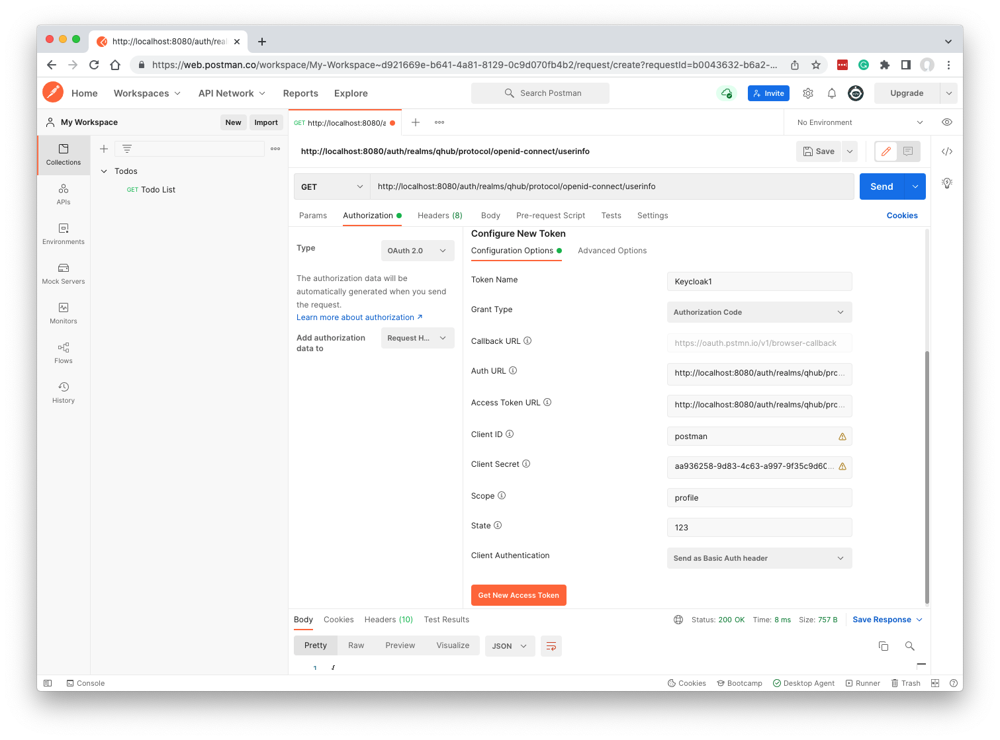

# Keycloak Testing

Keycloak is installed in the kubernetes cluster as part of QHub and it manages all users and groups, plus OAuth2 authentication for other QHub components such as JupyterHub and
Conda Store.

Sometimes you want a simple way to isolate and play around with Keycloak separately from QHub as a whole, but also want it to be configured in a similar way to Keycloak when part
of QHub.

## Run Keycloak in Docker

The Docker image is an easy way to get a standalone local Keycloak instance.

```bash
docker run -p 8080:8080 -e KEYCLOAK_USER=admin -e KEYCLOAK_PASSWORD=admin \
  --name keycloak --rm -v keycloakdata:/opt/jboss/keycloak/standalone/data \
  quay.io/keycloak/keycloak:15.0.2
```

Note: the volume mount (-v flag) should allow data to persist when you stop and start the container.

You can now visit the Keycloak admin panel at http://localhost:8080/auth/ and login with username and password both as `admin`.

## Configure Keycloak

When deployed within QHub, Terraform code will configure Keycloak in a certain way. Here we attempt to perform similar configuration, but of course check the code for the latest
config.

### Create QHub Realm

Once you've signed in, create a new realm. In the upper left portion of the admin console, you should see `Master`, which is the default realm. Hover over `Master` and a dropdown
should appear with a button labeled `Add realm`. Click that button. You should be taken to a form to create a new realm. Name the realm `qhub` (case sensitive) and click the
`Create` button. The admin console should now be in the qhub realm, as reflected in the upper left of the UI.

### Add groups and rules

All QHub deployments will have `users` and `admin` groups. For development, you need to add them manually. Click `Groups` on the side nav, and `New` - enter the name `users` in
lower case. Then do the same for `admin`.

The `users` group also needs to be configured so that it is a default group assigned to any new users. To do this, click the `Default Groups` tab within the `Groups` page. Click
`users` in the list of Available Groups, then `Add` to move it to the list of Default Groups on the left.

### Create an OAuth 2 client

Within the qhub realm, you will create a new client. Within QHub, a separate client exists for each of jupyterhub, conda-store, dask etc. In the side nav, click `Clients`, then
click the `Create` button. Fill out the form as show below:

| Form field | Value |
| --------------- | -------------- |
| Client ID | myclient |
| Client Protocol | openid-connect |

After clicking `Save`, you will be taken to the client settings form. Make sure the form fields are filled in as follows:

**Settings tab:**

| Setting | Value |
| ------------------- | ------------------------------------ |
| Access Type | confidential |
| Valid Redirect URIs | http://localhost:7010/oauth_callback |

> The redirect URI you use here will depend on how you want to test OAuth2 login flows. The example above would make sense if you are running your OAuth2 client (e.g. JupyterHub or
> Conda Store) at port 7010 locally, and it happens to have its callback URL at the path `/oauth_callback`.
>
> If you plan to test using Postman (see below) the callback will be `https://oauth.pstmn.io/v1/browser-callback`.

You will next create a new mapper for the myclient client. Go to the `Mapper` tab and click the `Create` button. Make sure the form is filled out as shown below and then click the
`Save` button.

**Mappers (create):**

| Name | Value |
| ------------------- | ---------------- |
| Name | groups |
| Mapper Type | Group Membership |
| Token Claim Name | groups |
| Full group path | OFF |
| Add to ID token | OFF |
| Add to access token | OFF |
| Add to userinfo | ON |

**Update: You may also want to set mappers for roles, which are now used for conda-store and dask.**

### Create Qhub login

You will now create a new user. This will be the user that you use to sign in to the Qhub control panel (which is separate from the Keycloak admin sign in).

In Keycloak, go to `Users` in the side nav and click `Add user`. Give the user any username that you want (for these instructions, we will assume `quser`) and click `Save`. Go to
the `Credentials` tab, toggle off the `Temporary` field, and set a password for your user (we will assume `quser` for the password).

In order for your new user to access the Qhub control panel, they must belong to the admin group. Go to `Users` in the side nav, click `View all users`, find your user, then click
`Edit` under the `Actions` column. Go to the `Groups` tab for Quser. Under `Available Groups`, you should see `admin`. Click on `admin` then click `Join`. You should see the
`Group Membership` box update with `/admin`.

## Understanding JupyterHub OAuth2

For example, for login to JupyterHub in QHub, the OAuth2 flow works as follows:

1. JupyterHub redirects to Keycloak at this URL: `https://myqhub.net/auth/realms/qhub/protocol/openid-connect/auth` with some extra parameters including the client ID of jupyterhub
   to say which client should be authenticated.
2. Keycloak redirects to the callback `https://myqhub.net/hub/oauth_callback` plus a short auth code.
3. JupyterHub makes a server-to-server call to `http://localhost:8080/auth/realms/qhub/protocol/openid-connect/token` in order to exchange that code for a more permanent access
   token.
4. JupyterHub then also makes a server-to-server call to `http://localhost:8080/auth/realms/qhub/protocol/openid-connect/userinfo` (passing the access token as authentication) in
   order to obtain extra information about the user. This step is generally optional in OAuth2.

If you check JupyterHub's logs you may see the results of the userinfo call - which should contain a list of groups due to the group mapper that was configured earlier. It may also
contain email address etc.

A similar flow happens for the other clients too (conda store etc).

## Testing OAuth2 using Postman

Without having to run a service such as JupyterHub to see, for example, that our group mapper is working, it is possible to test the login flow independently. It would be possible
using curl, but it takes a lot of effort to fully understand all the parameters needed at each stage.

Postman is an application for experimenting with APIs. It can run in your browser (which works best if you also install the 'Postman Agent' to run on your computer), or you can
install a native Mac app. See [Postman's website](https://www.postman.com/downloads/).

You can use Postman to try out the OAuth2 flow of a standalone Keycloak instance (in this example, running using Docker locally, as described above).

Create a client within the qhub realm, as described above (for `myclient`). Going forward, let's assume the client is called `postman` and you registered it with the callback URL
`https://oauth.pstmn.io/v1/browser-callback` (which is what Postman uses for this purpose).

In the Postman app, go into a workspace (My Workspace is the default) and open a new 'request tab' in the main working area of the screen.



In the big box at the top, next to GET, enter `http://localhost:8080/auth/realms/qhub/protocol/openid-connect/userinfo`.

In the Authorization tab change 'Type' to 'OAuth 2.0'.

Then 'Configure New Token' using the defaults plus the following:

- Auth URL: `http://localhost:8080/auth/realms/qhub/protocol/openid-connect/auth`
- Access Token URL: `http://localhost:8080/auth/realms/qhub/protocol/openid-connect/token`
- Client ID: `postman` (or whatever you chose)
- Client Secret: This is a guid-like string available from the Credentials tab of your Client in Keycloak
- Scope: `profile`

Click the 'Get New Access Token' button. You will be prompted to sign into Keycloak (use the user you created in 'Create QHub login' above, not the admin user).

This should result in an access token being displayed. Click the 'Use Token' button.

Now your authentication is ready and you can use it to call the userinfo API.

Click the blue 'Send' button towards the top of the window, next to the main userinfo URL.

The JSON results should be visible at the bottom of the window. If the group mapping was configured successfully, this should include a `groups` field listing any groups the user
has joined.
