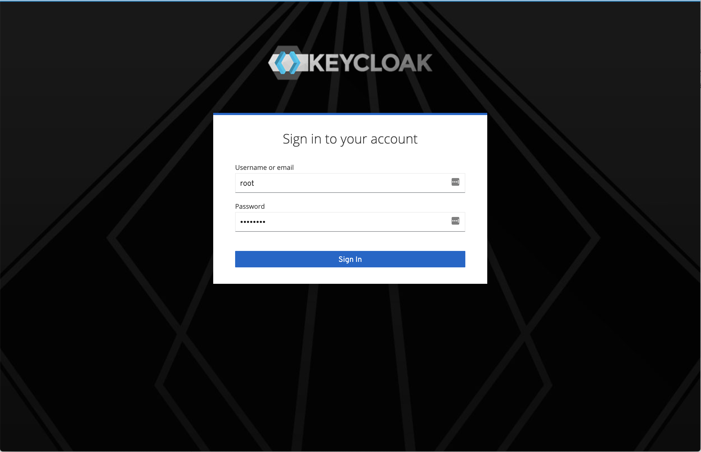
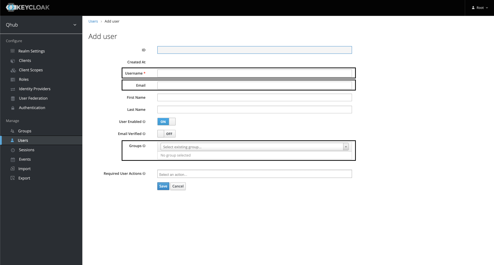
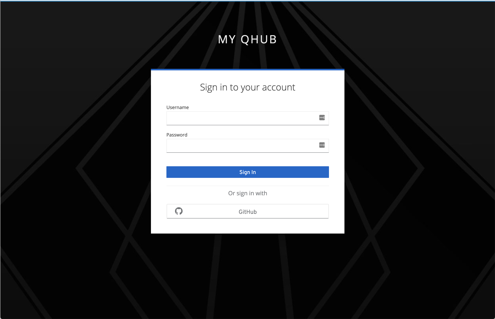
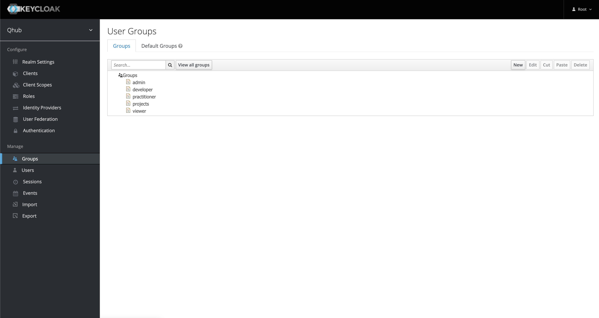
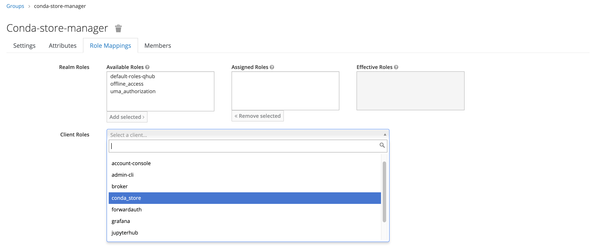
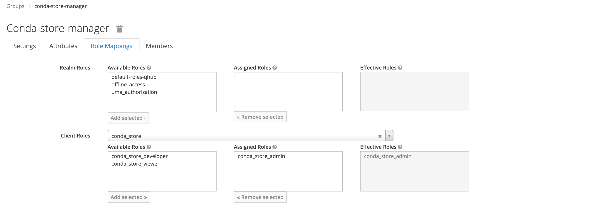

# Login

Keycloak is the name of the open source user management software that's automatically deployed within QHub. It's used to store the database of all users in your QHub site, and can provide connectivity to other services such GitHub/Auth0 single-sign on.

If you ran `qhub init` to create your `qhub-config.yaml` configuration file in the [Usage](usage.md) step, you will have been provided with a `random password for Keycloak root user`.

The password will also be visible in the `qhub-config.yaml` file under the `security.keycloak.initial_root_password` field.

Note that when your QHub is first deployed, the password given at that location will be set for the root Keycloak user. If added or changed for subsequent deployments, that password value will have no effect.

Please note the root Keycloak user is only able to login and manage the Keycloak identity management section of QHub. It's not a user of the wider QHub data science platform.

## Adding a QHub user

You will need to add a QHub user in order to login to your QHub platform. If you have chosen to use GitHub or Auth0 single-sign on, you must ensure the usernames you provide for new users in Keycloak match the usernames from GitHub/Auth0.

### Add user from command line

To make adding users easier for new QHub deployments, there is a QHub command that can help. It will only work if the initial_root_password for Keycloak has not yet been changed, so the value available in `qhub-config.yaml` is still correct.

Run:
```
qhub keycloak -c qhub-config.yaml adduser bob pa55w0rd
```

This will create a user called bob with the initial password provided. Omit the password completely if you are using GitHub or Auth0.

### Add user using Keycloak console

To add a QHub user from the web console for Keycloak, visit `https://myqhubsite.com/auth/admin/`

(Switch 'myqhubsite.com' for the domain you provided for your QHub deployment.)



Login using the username `root` and the password provided for the initial Keycloak root password.

All QHub users will be part of the `qhub` realm (a realm is a distinct identity provider and set of users in Keycloak). Note that the root user alone is a member of the `master` realm.

The `qhub` realm should be selected by default.

Click 'Users' along the left-hand side of the page.

Click the 'Add user' button and you will see the new user form:



There are three fields, outlined above, which should be filled out.These are 'Username', 'Email', and 'Groups'.

Depending on the authentication provider selected ('password', 'GitHub' or 'Auth0'), the values entered into the 'Username' field will differ slightly. The following table outlines those differences:

|   | Password  | GitHub  | Auth0   |
|---|---|---|---|
| Username | *unique username*  | *GitHub username* | *Email to login with* |

Once the 'Username' field has been updated, please add a valid email address in the 'Email' field.
> NOTE: although not required, users may not be able to log into Graphana if this field is not properly set.

Lastly, associate the user with one or more of the 'Groups'. By default, QHub is deployed with the following groups: 'admin', 'developer', 'practitioner' and 'viewer' (see below for more information about 'Groups').
> NOTE: users will not be able to log into JupyterLab if the user is in the 'viewer' group or if this field is unset.

Enter the name you would like for the user then click 'Save'.

Once the user has been created, you can set a password
> NOTE: not needed for GitHub/Auth0 based authentication.


It's best to unset the 'Temporary' on/off button so the user won't be forced to change the password on first login.

## Login to QHub

Your new user can now log into QHub proper (not Keycloak's admin console).

Visit `https://myqhubsite.com/` (or whatever domain you have chosen for your QHub).

Click 'Sign in with Keycloak'.



Enter the username and password you chose when you added a user to QHub above.

If you chose GitHub or Auth0 login, click the 'GitHub' button to be taken to a GitHub login page and single-sign on from there.

# Change Keycloak root password

You should change your root password for Keycloak now that you've got things running.

Back in `https://myqhubsite.com/auth/admin/` you can click on the 'Root' dropdown in the top right of the screen, and select 'Manage account'.

Under 'Account Security' click 'Signing In'.

In the Password box, click the 'Update' button. This will guide you through entering your existing root password, and then entering a new password.

From this point, the `security.keycloak.initial_root_password` field in `qhub-config.yaml` has no effect. If you redeploy QHub it will not reset the password back to the old one (or anything else that might be in the field in your YAML file). You can delete that line from your YAML file if you wish.

# Groups

Groups represent a collection of users that perform similar actions and therefore require the similar permissions. By default, QHub is deployed with the following groups: 'admin', 'developer', 'practitioner' and 'viewer'.

| Group | Access to QHub Resources |
|---|---|
| 'admin' | all resources  |
| 'developer' | JupyterLab, Dask, Graphana, Dashboards, Conda-Store  |
| 'practioner' | JupyterLab, Dashboards  |
| 'viewer'  | Dashboards  |

To create new groups or modify (or delete) existing groups, log in as `root` and click 'Groups' on the left-hand side.


As an example, we create a new group named `conda-store-manager` and this group will have administrator access to the Conda-Store service.



To create a new group, click 'New' in the upper-right hand corner. First, give the new group an appropriate name.


Then under 'Role Mapping', add the appriopriate 'Client Roles' as needed; there should be no need to update the 'Realm Roles'. In this example, the new group only has one mapped role however it's possible to attached multiple 'Client Roles' to a single group.





Once complete, return the 'Users' section and add the relevant users to this newly created group.
