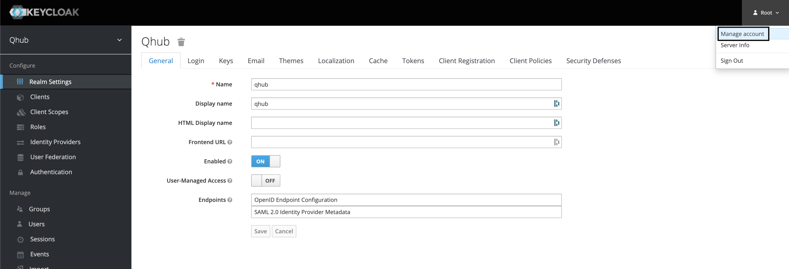
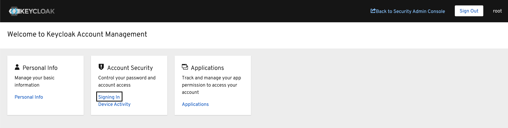

# Login

[Keycloak](https://www.keycloak.org/) is the name of the open-source user management software that's automatically deployed within QHub. It's used to store the database of all users in your QHub instance, and can provide connectivity to other services such as GitHub/Auth0 single-sign-on.

If you ran `qhub init` to create your `qhub-config.yaml` configuration file as detailed in the [Usage guide](usage.md), you will have been provided with a `random password for Keycloak root user`. **The password will also be visible in the `qhub-config.yaml` file under the `security.keycloak.initial_root_password` field**.

The `root` Keycloak user is only able to login and manage the Keycloak identity management section of QHub. It's not a user of the wider QHub data science platform.

## Change Keycloak root password

After the initial deployment, it is **highly** recommended that you change the Keycloak `root` user password as soon as you can.
> NOTE: From this point on, the `security.keycloak.initial_root_password` field in `qhub-config.yaml` has no effect. If you redeploy QHub it will not reset the password back to the old one (or anything else that might be in the field in your YAML file). We strongly recommend you delete this field.

1. To change the `root` user password, your QHub's instance admin dashboard i.e <https://myqhubsite.com/auth/admin/>, and log in with the password provided.


2. From there, click on the 'Root' dropdown in the top right of the screen, and select 'Manage account'.



3. Under 'Account Security' click 'Signing In'.



4. In the Password section, click the 'Update' button. This will guide you through entering your existing root password, and then creating a new password.


## Adding a QHub user

You will need to add a QHub user in order to log in to your QHub platform. If you have chosen to use GitHub or Auth0 single-sign-on, you must ensure the 'Username' you provide for new users in Keycloak matches the usernames from GitHub or Auth0 respectively.

### Add user using Keycloak console

To add a QHub user from the web console for Keycloak, visit <https://myqhubsite.com/auth/admin/>. Log in using the username `root`, as shown above.

All QHub users will be part of the `qhub` realm (a realm is a distinct identity provider and set of users in Keycloak).

> NOTE: The root user alone is a member of the `master` realm.

The `qhub` realm is selected by default, we strongly recommend leaving it as is.

1. Click 'Users' along the left-hand side of the page.

2. Click the 'Add user' button and you will see the new user form:


3. Fill out the three fields, outlined above. These are 'Username', 'Email', and 'Groups'.

Depending on the authentication provider selected ('password', 'GitHub' or 'Auth0'), the values entered into the 'Username' field will differ slightly. The following table outlines those differences:

|   | Password  | GitHub  | Auth0   |
|---|---|---|---|
| Username | *unique username*  | *GitHub username* | *Email to login with* |

Once the 'Username' field is updated, please add a valid email address in the 'Email' field.
> NOTE: Although not required, users may not be able to log into Grafana if this field isn't properly set.

Lastly, associate the user with one or more of the 'Groups'. Out of the box, QHub is deployed with the following groups: 'admin', 'analyst', and 'developer' (see the [Groups](./login.md#groups) section below for more details).

Enter the name you would like for the user then click 'Save'.

Once the user is created, you can set a password.
> NOTE: Not needed for GitHub/Auth0 based authentication.


It's best to unset the 'Temporary' on/off button so the user won't be forced to change the password on first login.

### Add user from the command line

To make adding users easier for new QHub deployments, there is a QHub command that can help.

> NOTE: If you changed the initial_root_password for Keycloak this method will not work.

> NOTE: This method is primarily used by developers as a quick workaround.


Run:

```shell
qhub keycloak -c qhub-config.yaml adduser <username> <password>
```

This will create a user  `<username>` with the initial password provided. Omit the password completely if you are using GitHub or Auth0.

> NOTE: This will also add the user to 'analyst' group.

## Login to QHub

Your new user can now log into the main QHub dashboard (not Keycloak's admin console).

Visit <https://myqhubsite.com/> (or whatever domain you have chosen for your QHub).

Click 'Sign in with Keycloak'.


If you chose GitHub or Auth0 login, click the 'GitHub' button to be taken to a GitHub login page and single-sign-on from there (as shown in the screenshot above). Otherwise, if you choose 'Password` based authentication, enter the username and password you chose when you added a user to QHub above.

## Groups

Groups represent a collection of users that perform similar actions and therefore require the similar permissions. By default, QHub is deployed with the following groups: 'admin', 'developer', 'analyst' and 'viewer'.

| Group | Access to QHub Resources |
|---|---|
| 'admin' | Conda-Store Admin <br> Dask Admin <br> Jupyterhub Admin <br> Graphana Admin |
| 'analyst' | Conda-Store Developer <br> Jupyterhub Developer <br> Graphana Viewer |
| 'developer' | Conda-Store Developer <br> Dask Developer <br> Jupyterhub Developer <br> Graphana Developer |

To create new groups or modify (or delete) existing groups, log in as `root` and click 'Groups' on the left-hand side.

As an example, we create a new group named `conda-store-manager` and this group will have administrator access to the Conda-Store service.


To create a new group, click 'New' in the upper-right hand corner. First, give the new group an appropriate name.


Then under 'Role Mapping', add the appriopriate 'Client Roles' as needed; there should be no need to update the 'Realm Roles'. In this example, the new group only has one mapped role however it's possible to attached multiple 'Client Roles' to a single group.


Once complete, return to the 'Users' section in the dashboard and add the relevant users to this newly created group.
