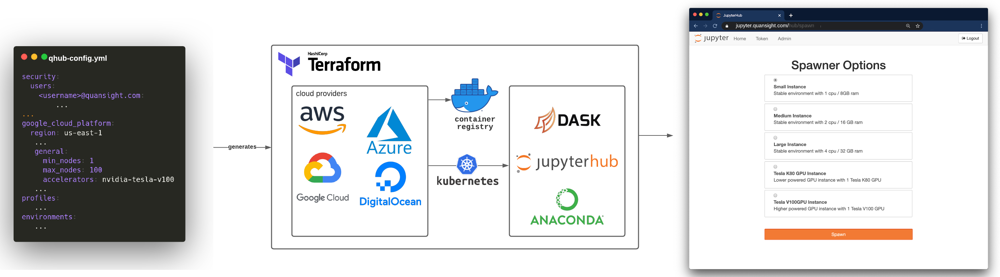

# What is QHub?
Open source tool for data science research, development, and deployment.

QHub is [**Infrastructure as Code**](https://en.wikipedia.org/wiki/Infrastructure_as_code)
that simplifies the deployment of data science projects using JupyterHub and Dask Gateway for you and your team.

Designed to simplify the deployment and maintenance of scalable computational platforms in the cloud, QHub is ideal for
organizations that need a shared compute platform that is flexible, accessible, and scalable.

## QHub Technology Stack

### Components

The technology stack is an integration of the following existing open source libraries:

+ [**Terraform**](https://www.terraform.io/intro/index.html) a tool for building, changing, and versioning infrastructure.
+ [**Kubernetes**](https://kubernetes.io/docs/home/) a cloud-agnostic orchestration system
+ [**Helm**](https://helm.sh/): a package manager for Kubernetes
+ [**JupyterHub**](https://jupyter.org/hub): a shareable compute platform for data science
+ [**JupyterLab**](https://jupyterlab.readthedocs.io/en/stable/): a web-based interactive development environment for Jupyter Notebooks
+ [**Dask**](https://docs.dask.org/en/latest/): a scalable and flexible  library for parallel computing in Python
  + [**Dask-Gateway**](https://gateway.dask.org/): a secure, multi-tenant server for managing Dask clusters
+ [**traefik**](https://traefik.io/) for routing web/tcp traffic inside cluster
+ [**traefik-forward-auth**](https://github.com/thomseddon/traefik-forward-auth) single sign on and easy securing of web applications
+ [**GitHub Actions**](https://docs.github.com/en/actions): a tool to automate, customize, and execute software
  development workflows in a GitHub repository.

Amongst the newly created open source libraries on the tech stack are:
+ [**jupyterhub-ssh**](https://github.com/yuvipanda/jupyterhub-ssh) brings the SSH experience to a modern cluster manager.
+ [**jupyter-videochat**](https://github.com/yuvipanda/jupyter-videochat) allows video-chat with JupyterHub peers inside
  JupyterLab, powered by Jitsi.
+ [**conda-store**](https://github.com/quansight/conda-store) serves identical conda environments and controls its life-cycle.
+ [**conda-docker**](https://github.com/conda-incubator/conda-docker), an extension to the docker concept of having
  declarative environments that are associated with Docker images allowing tricks and behaviour that otherwise would not be allowed.
+ [**vscode**](https://github.com/cdr/code-server) built-in web editor tied to jupyterlab server

### Integrations

In an effort for QHub to serve as a core that services can integrate
with.

+ [**prefect**](https://www.prefect.io/) workflow management
+ [**clearml**](https://clear.ml/) machine learning platform

# Why use QHub?

QHub provides enables teams to build their own scalable compute infrastructure with:

+ Easy installation and maintenance controlled by a single configuration file.
+ Autoscaling JupyterHub installation deployed on the Cloud provider of your choice.
+ Option to choose from multiple compute instances, such as: **namely normal**, **high memory**, **GPU**, etc.
+ Autoscaling Dask compute clusters for big data using any instance type.
+ Shell access and remote editing access (i.e. VSCode remote) through KubeSSH.
+ Full linux style permissions allowing for different shared folders for different groups of users.
+ Robust compute environment handling allowing both prebuilt and ad-hoc environment creation.
+ Integrated video conferencing, using [Jitsi](https://meet.jit.si/).
