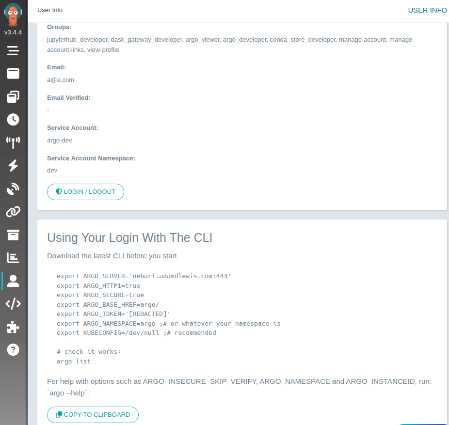

# Argo Workflows

Argo Workflows is an open source container-native workflow engine for orchestrating parallel jobs on Kubernetes. Argo
workflows comes enabled by default with Nebari deployments.

## Accessing Argo Server

If Argo Workflows is enabled, users can access argo workflows server at: `your-nebari-domain.com/argo`. Log in via
Keycloak with your usual credentials.

## Submitting a Workflow via Argo Server

You can submit a workflow by clicking "SUBMIT NEW WORKFLOW" on the landing page assuming you have the appropriate
permissions.

## Submitting a workflow via Argo CLI

You can submit or manage workflows via the Argo CLI. The Argo CLI can be downloaded from the
[Argo Releases](https://github.com/argoproj/argo-workflows/releases) page. After downloading the CLI, you can get your
token from the Argo Server UI by clicking on the user tab in the bottom left corner and then clicking "Copy To
Clipboard". You'll need to make a few edits to access to what was copied for Argo CLI to work correctly. The base href
should be `ARGO_BASE_HREF=/argo` in the default nebari installation and you need to set the namespace where Argo was
deployed (dev by default) `ARGO_NAMESPACE=dev`. After setting those variables and the others copied from the Argo Server
UI, you can check that things are working by running `argo list`.

## Additional Argo Workflows Resources

Refer to the [Argo documentation](https://argoproj.github.io/argo-workflows/) for further details on Argo Workflows.
