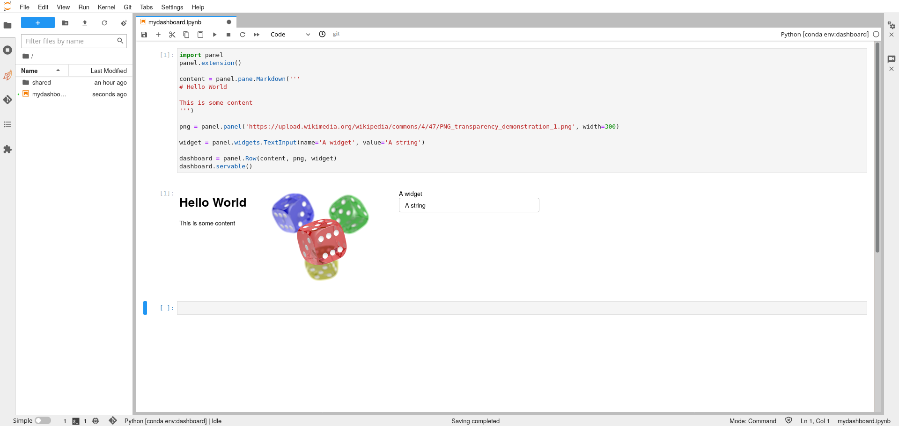
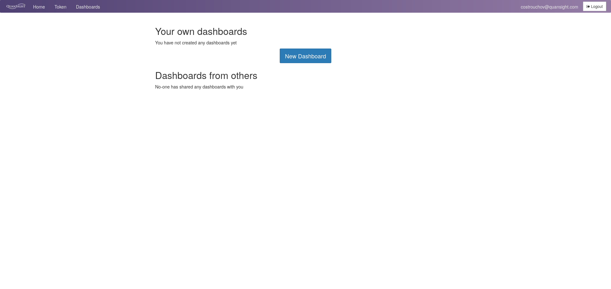
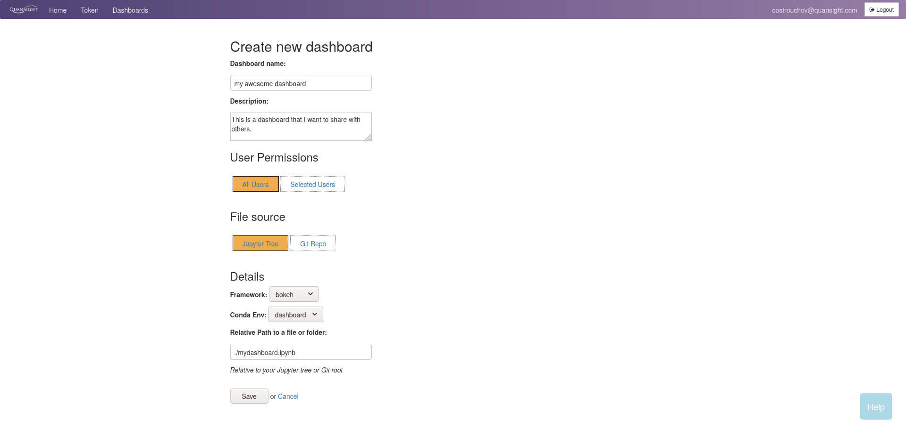
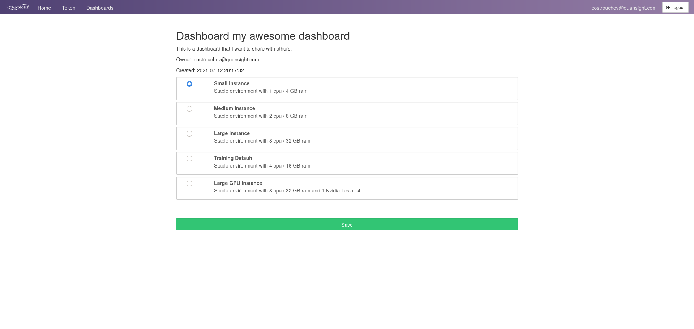

# Dashboards

QHub encourages users to create dashboards that can be shared with other users and groups via [ContainDS Dashboards](https://cdsdashboards.readthedocs.io/en/stable/). Currently,
this dashboarding solution supports Panel, Bokeh, Voila, Streamlit, and Plotly. The solution is general purpose enough to support any web app. For a more detailed guide on using
CDSDashboards, see the [documentation](https://cdsdashboards.readthedocs.io/en/stable/index.html).



Create a notebook in your jupyterlab environment with the following code in a notebook named `mydashboard.ipynb` in the home directory.

```python
import panel
panel.extension()

content = panel.pane.Markdown('''
# Hello World

This is some content
''')

png = panel.panel('https://upload.wikimedia.org/wikipedia/commons/4/47/PNG_transparency_demonstration_1.png', width=300)

widget = panel.widgets.TextInput(name='A widget', value='A string')

dashboard = panel.Row(content, png, widget)
dashboard.servable()
```

Once you execute the notebook you should see the output shown above. We will now show how to create a dashboard from this notebook. Keep in mind that for other dashboard-based
solutions, for example Voila, the instructions will be slightly different, in which case we recommend visiting the
[cds docs](https://cdsdashboards.readthedocs.io/en/stable/index.html). Visit your hub homepage which is at `https://<qhub-url>/hub/dashboards` or click the dashboard tab in the hub
home menu.



Click `New Dashboard` and give the dashboard any name and description. For now, allow `all users` and use the `jupyter tree`. Note that `bokeh` was selected for the framework since
panel uses bokeh under the covers. Choose the conda environment `dashboard`. Finally, supply a relative path to the dashboard you would like to launch. In this case
`./mydashboard.ipynb` since this is the name of the dashboard created above in the notebook.



Once you have saved the dashboard, you will be taken to the screen to select the resources the dashboard will have available to it.



Once the resources have been chosen, click save and the dashboard will launch. This should provide a dedicated url that you can share with other QHub users to view the dashboard.
In the case of this dashboard the url was `https://training.qhub.dev/user/costrouchov@quansight.com/dash-my-awesome-dashboard/`, but your url will be different. The url will force
authentication for the user to view the dashboard. The dashboard for the notebook in this example is shown below.


