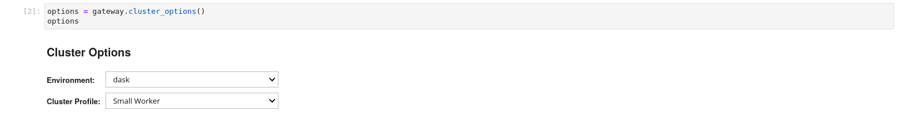
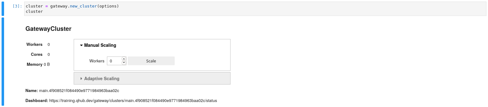

# Using Dask Gateway

[Dask Gateway](https://gateway.dask.org/) provides a secure way to managing dask clusters. QHub uses dask-gateway to expose auto-scaling compute clusters automatically configured for the user. For a full guide on dask-gateway please [see the docs](https://gateway.dask.org/usage.html). However here we try to detail the important usage on QHub.

QHub already has the connection information pre-configured for the user. If you would like to see the pre-configured settings, run

```shell
cat /etc/dask/gateway.yaml
```

 - `address` :: is the rest API that dask-gateway exposes for managing clusters
 - `proxy_address` :: is a secure tls connection to a user-started dask scheduler
 - `auth` is the form of authentication used, which should always be `jupyterhub` for QHub

## Starting a Cluster

```python
from dask_gateway import Gateway
gateway = Gateway()
```

QHub has [a section](https://docs.qhub.dev/en/stable/source/installation/configuration.html#profiles) for configuring the dask profiles that users have access to. These can
be accessed via Dask Gateway options. Once the [ipywidget](https://ipywidgets.readthedocs.io/en/latest/) shows up the user can select the options they care about. If you are interacting in a terminal there are also ways to configure the options. Please see the dask-gateway docs. It's important that the environment used for your notebook matches the dask worker environment.



```python
options = gateway.cluster_options()
options
```

Once the desired settings have been chosen the user creates a cluster (launches a dask scheduler).



```python
cluster = gateway.new_cluster(options)
cluster
```

The user is presented with a GUI to scale up the number of workers. At first, users start with `0` workers. In addition you can scale up via Python functions. Additionally the GUI has a `dashboard` link that you can click to view [cluster diagnostics](https://docs.dask.org/en/latest/diagnostics-distributed.html). This link is especially useful for debugging and benchmarking.

```python
cluster.scale(1)
```

Once you have created a cluster and scaled to an appropriate number of workers we can grab our dask client to start the computation. You may also use the cluster menu with the dashboard link to scale the number of workers.

```python
client = cluster.get_client()
```

Finally let's do an example calculation to prove that everything works.

```python
import dask.array as da
x = da.random.random((10000, 10000), chunks=(1000, 1000))
y = x + x.T
z = y[::2, 5000:].mean(axis=1)
z.compute()
```

If a result was returned, your cluster is working.

## Cluster Options

Dask Gateway allows users to configure their clusters via cluster options. Here are some configuration options exposed in QHub's Dask Gateway deployment.

* Get cluster options

```python
import dask_gateway
gateway = dask_gateway.Gateway()
options = gateway.cluster_options()
```

### Setting Environment variables for Dask Workers

```python
options.environment_vars = {
    "ENV_VAR_1": "VALUE_1",
    "ENV_VAR_2": "VALUE_2",
}
```

### Setting Conda Environment for Dask Workers

```python
options.conda_environment = "tensorflow"
```

Note: The above configuration options are valid for QHub's Dask Gateway deployment, these might be different for a non QHub deployment, like say Pangeo's Dask Gateway deployment.

## Accessing Cluster Outside of QHub

A long requested feature was the ability to access a dask cluster from outside of the cluster itself. In general this is possible but at the moment can break due to version mismatches between [dask](https://dask.org/), [distributed](https://distributed.dask.org/en/latest/), and [dask-gateway](https://gateway.dask.org/). Also we have had issues with other libraries not matching so don't consider this check exhaustive. At a minimum, check that your local environment matches. It's possible that it will work if the versions don't match exactly, but it's not recommended.

```python
import dask, distributed, dask_gateway
print(dask.__version__, distributed.__version__, dask_gateway.__version__)
```

Next you need to supply a JupyterHub API token to validate with the Dask Gateway API. This was not required within QHub since this is automatically set in JupyterLab sessions. There are several ways to get a JupyterHub API token.

The easiest way is to visit `https://<qhub-url>/hub/token` when you are logged in and click `Request new API token`. This should show a long string to copy as your API token.

```python
import os
os.environ['JUPYTERHUB_API_TOKEN'] = '9da45d9...................37779f'
```

Finally you will need to manually configure the `Gateway` connection parameters. The connection parameters can be easily filled in based on the `<qhub-url>` for your deployment.

```python
gateway = Gateway(address='https://<qhub-url>/gateway', auth='jupyterhub', proxy_address='tcp://<qhub-url>:8786')
```

Now your gateway is properly configured. You can follow the usage tutorial above. If your dask, distributed, and dask-gateway versions don't match, connecting to these APIs may (most likely will) break in unexpected ways.

## Common Errors

As mentioned above, version mismatches between dask, dask-gateway, and distributed are extremely common. Here are some common errors and the most likely fixes for them:

```python
...
GatewayClusterError(msg)

ValueError: 404: Not Found
```

This error is due to a version mismatch between the dask-gateway client and dask-gateway server.

If you get `struct unpack` related errors when using dask this is most likely a mismatch in versions for [Dask](https://pypi.org/project/dask/) or [distributed](https://pypi.org/project/distributed/). The last issue Quansight has run into was due to the version of bokeh being used for the dask dashboard.
