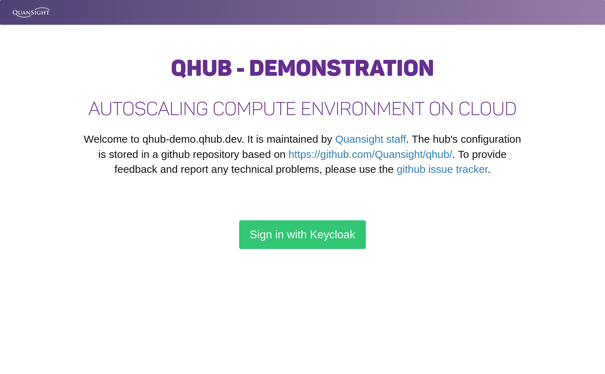
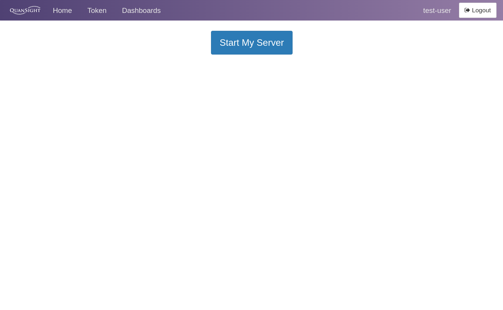
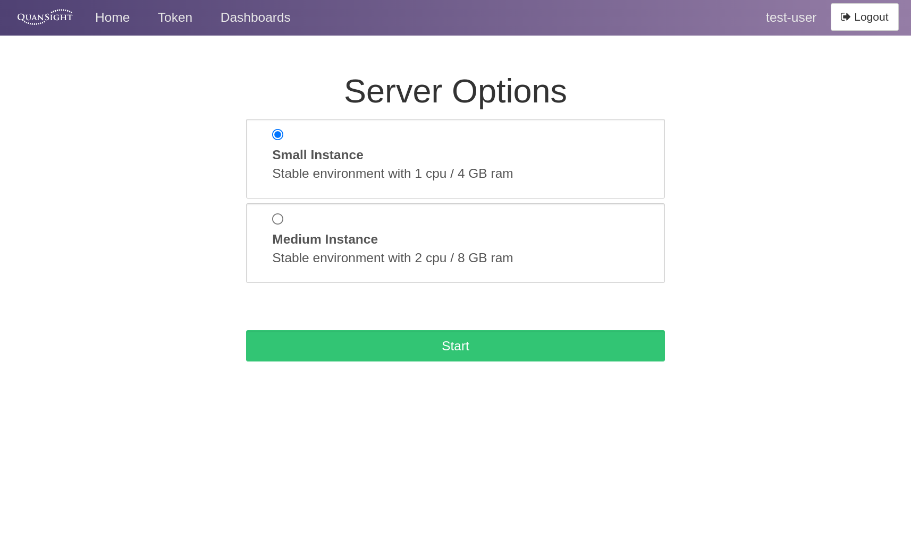
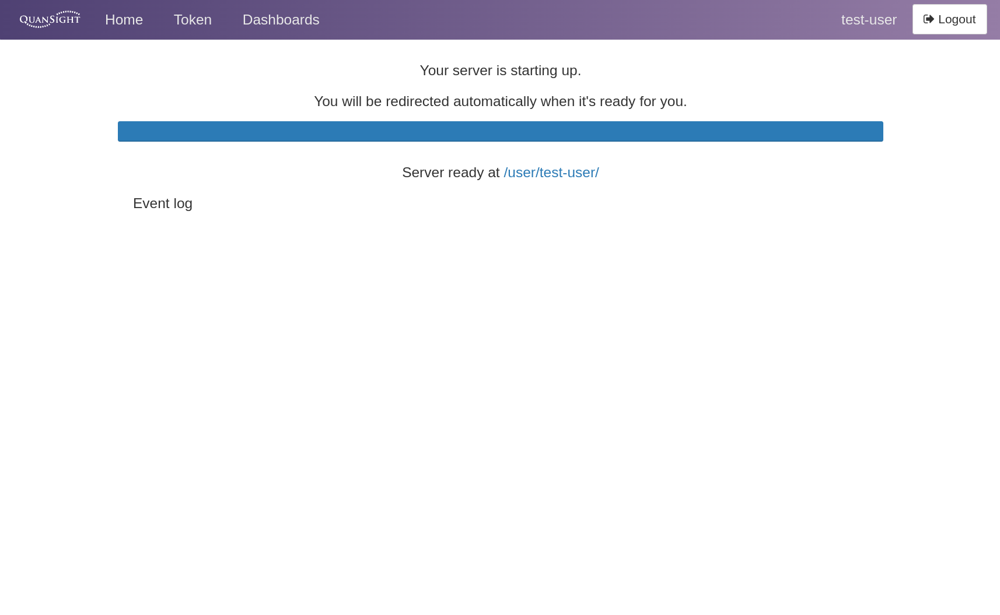
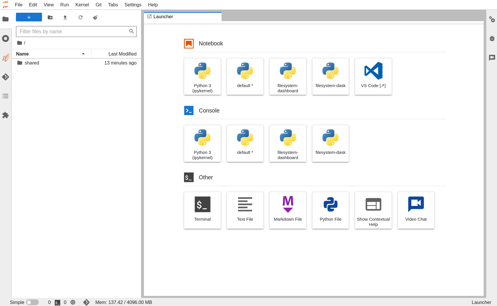

# Login to QHub

This guide aims to give a basic overview of the QHub login process. Your organization's QHub will likely have a slightly
different authentication process due to the many authentication providers that QHub can integrate with.

The first step is to connect with your QHub cluster, for this example we will be using `https://qhub-demo.qhub.dev`.
Once on the site, you will be prompted by a login, similar to the login page shown in the image below.

Qhub now uses an open source tool called Keycloak for user management. This makes it a little challenging to detail the
exact process as it might differ greatly between authentication providers (LDAP, OAuth 2.0, passwordless authentication,
password-based authentication and many others). A deeper overview of the QHub authentication process is described in the
[Authentication Guide](../installation/login.md).

For this demonstration we will present the user with password-based or GitHub authentication.

Once authenticated, the user will be forwarded to the main hub page where the user will have access to `Token`
management, JupyterLab server access, and other features like `Dashboards` and `Admin` management.

After `Start My Server` is selected, the user will be prompted with a set of profiles that are available for the
authenticated user. Your given selections will likely differ from the image shown. The customized profiles will give you
access to fixed cloud resources. For example, you could choose a resource with 2 CPUs, 8 GB RAM, and 1 dedicated GPU,
all of which is configured by your administrator. A more detailed explanation of dedicated profiles can be found in the
[Profiles](../installation/configuration.md#profiles) section of the advanced configuration page.

Once an appropriate profile has been selected, click `start`. At this point, your JupyterHub instance will be launched,
a step which may take up to several minutes due to QHub use of autoscaling under the hood. Ultimately this autoscaling
feature helps reduce costs when the cluster is idle. A successful launch should look similar to the image below.

Once your JupyterHub instance has been launched you will notice a selection of available Python environments. These
environments will also represent the different kernel choices available for your notebooks. They are created and managed
by conda-store and can be easily configured. Learn more at
[Managing environments](../installation/configuration.md#environments).

From the Launcher, you can choose a JupyterLab notebook with a given conda environment. Note that kernels can take
several seconds to become responsive. The circle in the top right-hand corner is a good indicator of the status of the
kernel. A lightning bold means that the kernel has started, but it is not yet ready to run code. An open circle means
it's ready.
