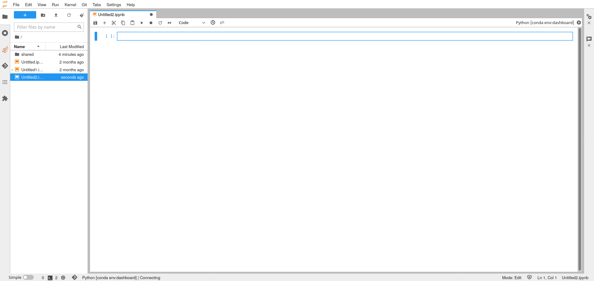

# Log into QHub

This guide aims to explain to newcomers how to log in to QHub.  Your
own organization's QHub is likely to have a slighly different
procedure for the authentication due to the many authentication
providers that QHub can integrate into.

Get the url of your QHub cluster. For this example we will use
`https://training.qhub.dev`.

Upon visiting the website you will be prompted by a login page similar
to the login page shown above. The login process will greatly differ
between authentication providers. Qhub supports LDAP, OAuth2,
Passwordless Auth, password based authentication and many others (any
that jupyterhub supports) meaning that it is hard to detail the exact
login process.

Once authenticated the user will be prompted with a set of profiles
that are available for the authenticated user to use. Your given
selections will likely differ from the image shown. The customized
profiles will give you access to fixed resources e.g. 2 cpu, 8 GB ram,
and 1 dedicated gpu. All of this is configured by the
administrator. Click `start` once the appropriate profile has been
chosen. The cluster may take several minutes to launch. This is due to
Qhub using autoscaling behind the scenes to reduce costs when the
cluster is idle.

Finally once your cluster has launched you will notice a huge
selection of available python environments. These environments are
configured by your administrator.

When you click on a given kernel a jupyterlab notebook with that given
environment will launch. Note that kernels can take several seconds to
become responsive. The circle in the top right hand corner is a good
indicator at the status of the kernel. A lightning bold means that the
kernel has started but it not yet ready to run code.

