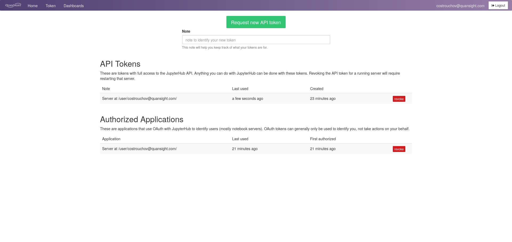

# SSH/SFTP Access

Using [`jupyterhub-ssh`](https://github.com/yuvipanda/jupyterhub-ssh),
QHub has the ability for remotely accessing the cluster and a
juypterlab environment via
[`ssh`](https://en.wikipedia.org/wiki/Secure_Shell). In addition, users
can easily transfter files back and forth via
[`sftp`](https://en.wikipedia.org/wiki/SSH_File_Transfer_Protocol). QHub
provides a secure manner for users to login while also providing additional
ways to connect to the cluster. This allows users to use terminal based
editors (such as emacs or vim) to automate tasks on the
cluster without requiring browser access. For more detailed information on
using `jupyterhub-ssh`, please refer to the
[documentation](https://jupyterhub-ssh.readthedocs.io/en/latest/index.html).

In order to login via `ssh` a user needs to generate an API token. Visit
`https://<qhub-url>/hub/token`. Where `<qhub-url>` is the domain name of
your QHub cluster. You will be shown a screen similar to the one
shown below. You need only generate the API token once and can be reused going forward; to revoke this API token, simply return to this page and click `revoke`.



Click on `Request new API token` with a short description such as `ssh login token`. Copy down the generate api token (in
this case `f0b80688484a4ac79a21b38ec277ca08`).


You can now login to the QHub cluster via the terminal using `ssh`. Note
from the API generation screen in the top right hand corner, you can
see the username that you should use for login. `ssh` handles usernames
with an `@` symbol meaning that you will need to provide the username
explicitly when trying to connect via `ssh`. See the example below for details.
> NOTE:
> - `ssh` uses port `8022`
> - `sftp` uses port `8023`

```
$ ssh -o User=costrouchov@quansight.com training.qhub.dev -p 8022
The authenticity of host '[training.qhub.dev]:8022 ([35.223.107.201]:8022)' can't be established.
RSA key fingerprint is SHA256:mKy546LpI0cbqm/IY8dQR0B5QcbEziWLjLglern5G+U.
This key is not known by any other names
Are you sure you want to continue connecting (yes/no/[fingerprint])? yes
Warning: Permanently added '[training.qhub.dev]:8022' (RSA) to the list of known hosts.
(costrouchov@quansight.com@training.qhub.dev) Password:
costrouchov@quansight.com@jupyter-costrouchov-40quansight-2ecom:~$
```
