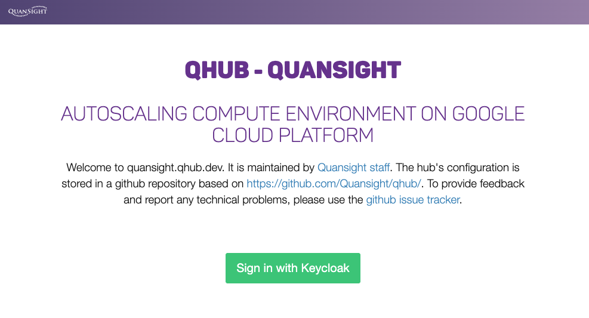
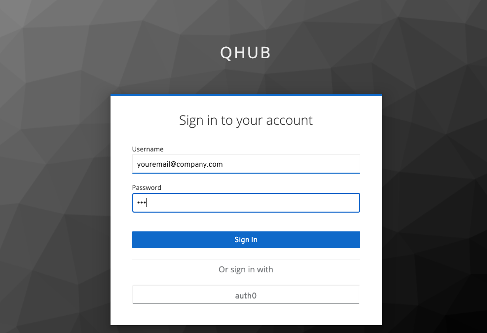
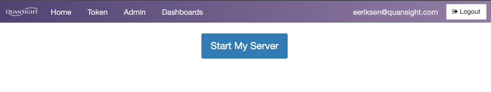
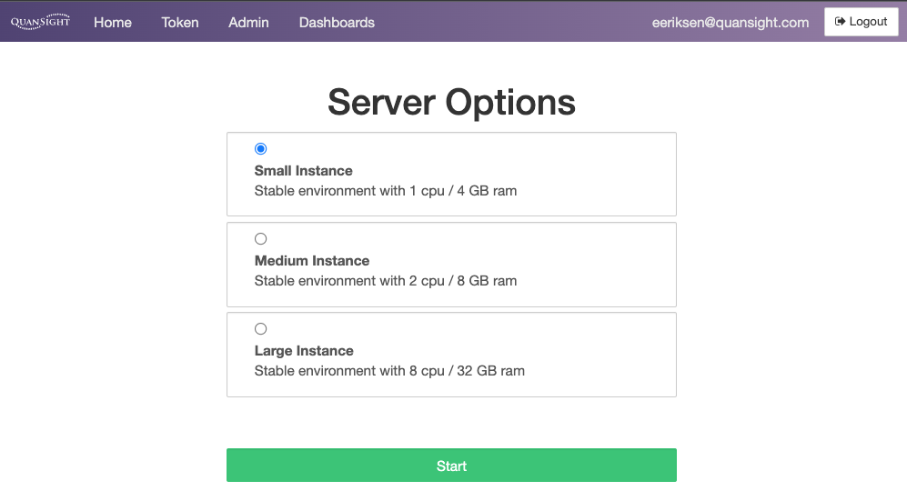
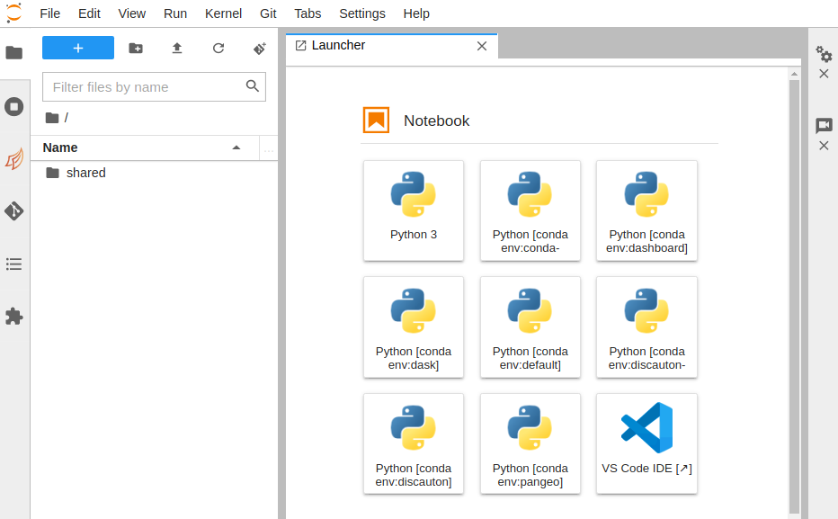

# QHub training cluster

Quansight provides training around the [PyData](https://pydata.org/) ecosystem. For this training material, a QHub based
training cluster is utilized. This guide explains to newcomers how to log into Quansight's own QHub Training server. If
you are looking for instructions on logging into your own organization's QHub see the user
[getting started docs](getting_started.md).

The person in charge of organizing the training on non-Quansight side will provide a list of names and email addresses.
In preparation of the upcomng training session, the Quansight training team will add those users to the aforementioned
QHub instance. The instructions that follow assume your user has been added.

To access the training platform:

1. Navigate tp [https://quansight.qhub.dev](https://quansight.qhub.dev).

2. Enter your email address, the one associated with your invitation and enter the password. At the start of the
   training session, your trainer will share this password with you.

3. This should allow you to launch the QHub instance for training. Once logged in, you should see the page below.

4. Once the `Start my Server` button is clicked, a prompt with different server instances is displayed.

5. Click on the `Training Default` option, or whichever option your instructor has directed you to, and wait to access
   your new JupyterHub instance, similar to the image below.

Congratulations, you are now logged in to QHub.

> In case you run into any issues, please contact your instructor via email.
