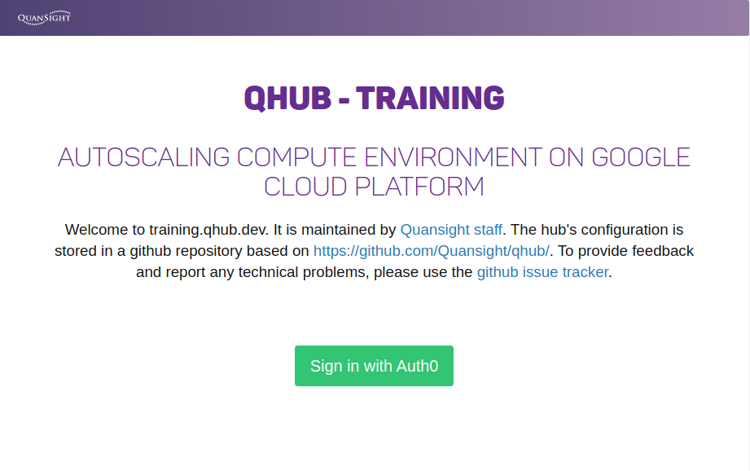
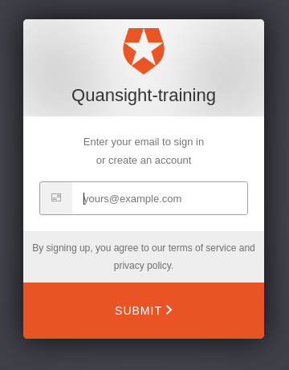
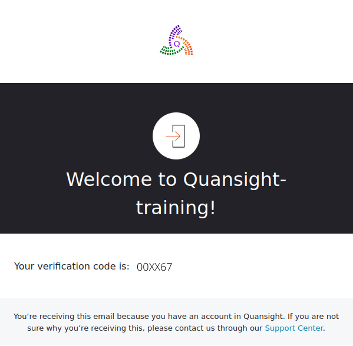
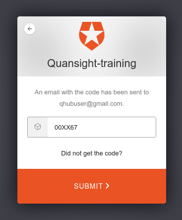
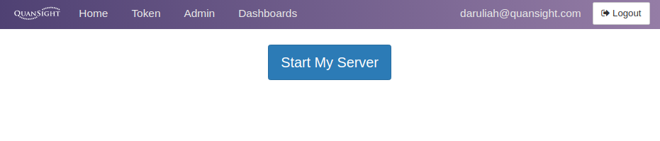
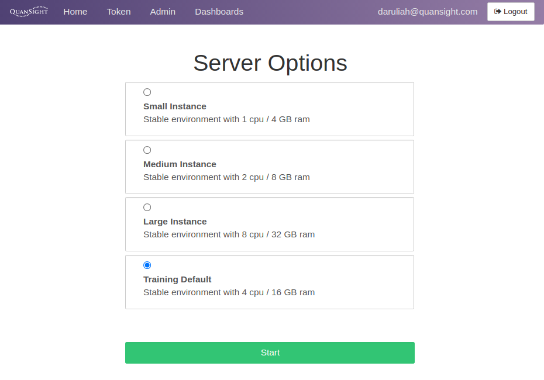
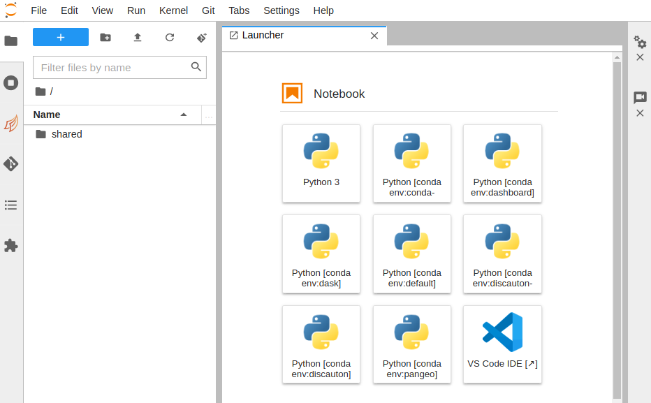

# QHub training cluster

Quansight provides training around the [PyData](https://pydata.org/) ecosystem. For this training material, a Qhub based training cluster is utilized. This guide explains to newcomers how to log into Quansight's own QHub Training server. If you are looking for instructions on logging into your own organization's QHub see the user [getting started docs](getting_started.md).

To access the training platform:

1. Register on [https://training.qhub.dev](https://training.qhub.dev).

2. Enter your email address. Ideally use the one associated with your invitation.

3. You should then receive an email from **Quansight-training** with a 6-digit code. Remember to check your spam folder just in case.

4. Copy the code, head back over to the [https://training.qhub.dev](https://training.qhub.dev) webpage, and paste it when prompted.

5. This should allow you to launch the QHub instance for training. Once logged in, you should see the page below.

6. Once the `Start my Server` button is clicked, a prompt with different server instances is displayed.

7. Click on the `Training Default` option, or whichever option your instructor has directed you to, and wait to access your new JupyterHub instance, similar to the image below.

Congratulations, you are now logged in to QHub.

> In case you run into any issues, please contact your instructor via email.
